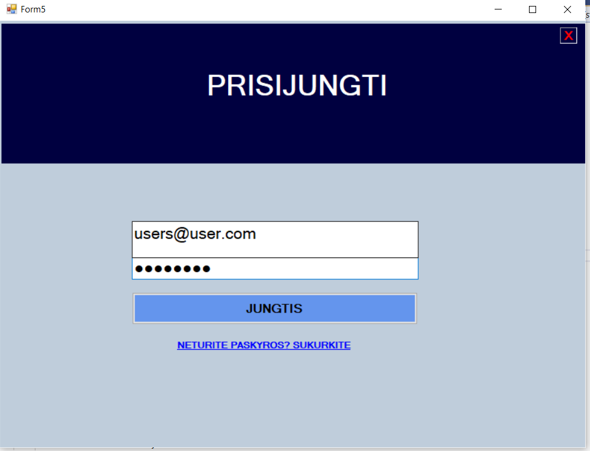
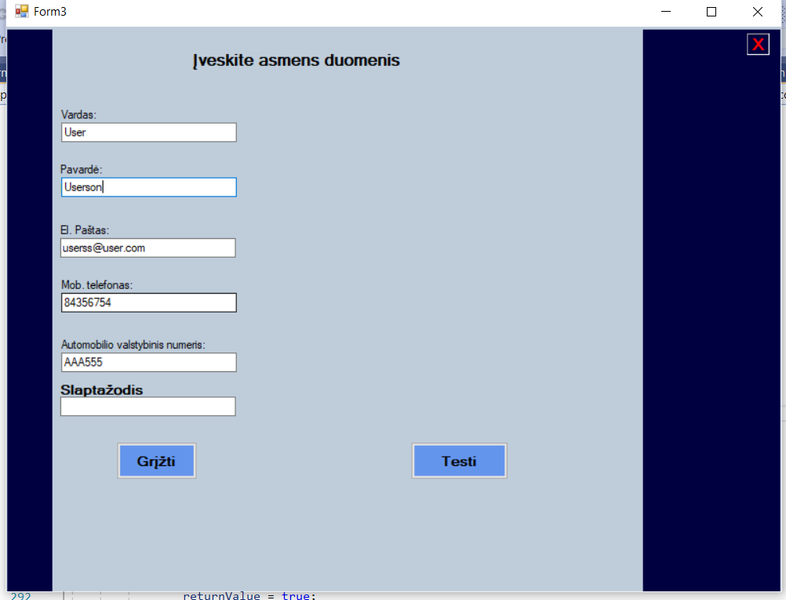
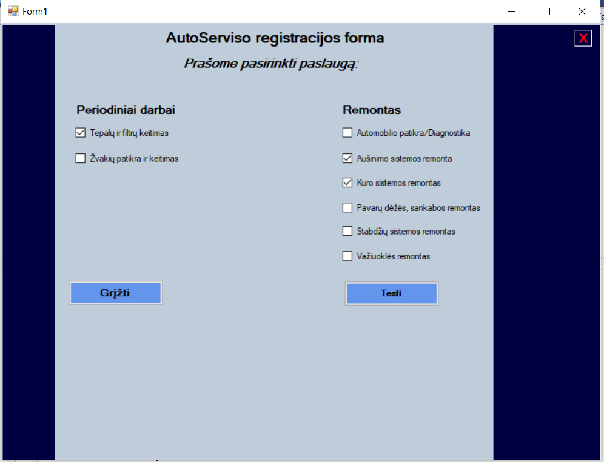
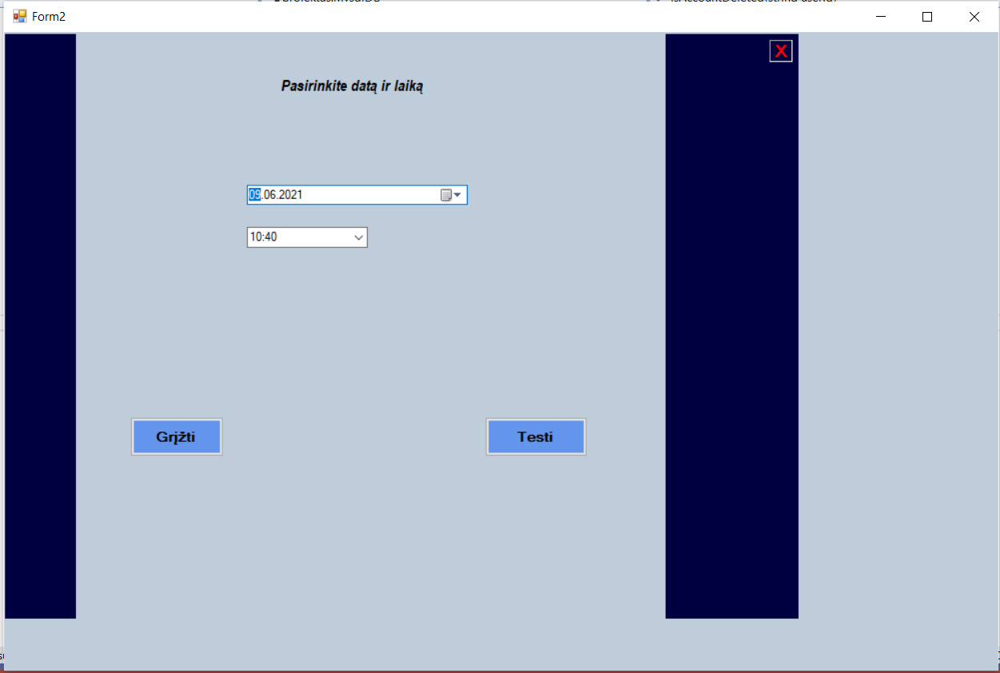
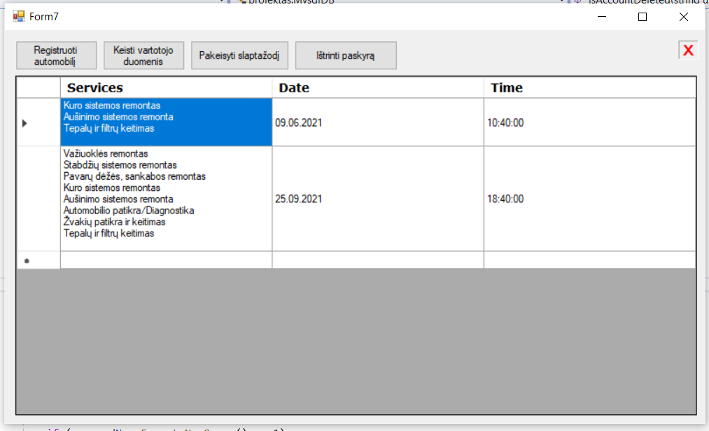

### Table of contest
1. [About](#about)
2. [Images](#images)
3. [Used technologies](#used-technologies)

## About

The purspose of this project is to make app in group of three people for registration car repairent service and save to the MySQL database
with the possibility to see saved results.

## Images

## Used technologies
1. C#
	1. Windows Forms
2. MySQL
